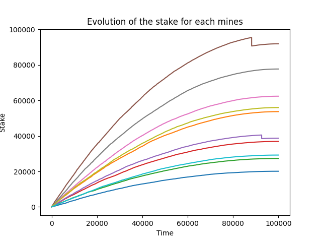
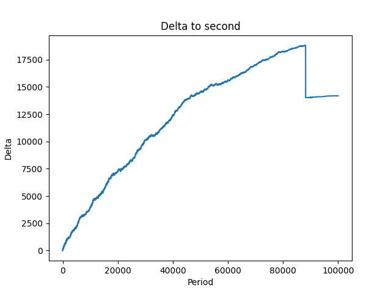
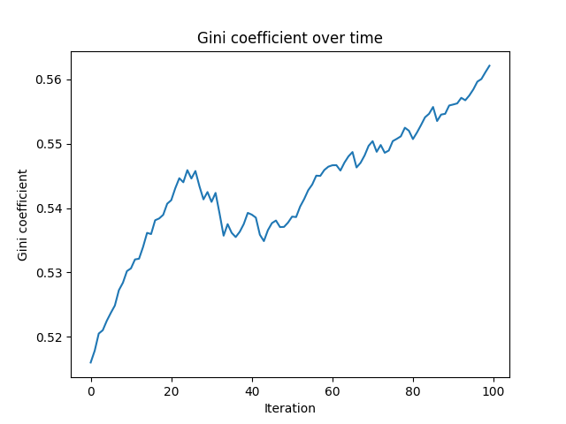

# Polya Urn simulation of Proof of stake reward mechanism

&copy; Maxence Raballand 2021

This is a simulation of the Proof of stake rewarding system with python using the Polya Urn model.

This work was done for my study in progress on the security of Proof of stake blockchains and here especially on the concentration of wealth with compounding.

## Evolution of stake result

The result in the evolution the of the stake is quite evocative. In fact, there is a clear gap between the first validators and others. With a simple decreasing reward, we gat an evolution of the stakes as such :

As it is a "perfect" simulation, we can see the evolution very clearly. A second graph that shows the compounding effect is a graph that plots the difference in stake between the first and second.

I did other simulation with other reward function but I'm not going to go into detail as they're experimental.

## Compounding effect with the Gini coefficient

The Gini coefficient is a number that tells us about the wealth distribution. If the wealth distribution is relatively good, then it will be close to 0. If it's not good, it' going to be close to 1. This index is used to compute the inequalities in countries around the world (as we can see from the [wikipedia page](https://en.wikipedia.org/wiki/Gini_coefficient)).

As we can see from the graph below, the Gini coefficient is growing over time with this simple system. It really shows that not everyone is having more and more money but that the inequality gap is growing bigger.

